# 🤖 AI Automation & Analytics Workflow

> Portfolio project focused on **AI-powered automation** + **actionable analytics**. Designed for recruiters and to showcase an end-to-end workflow: ingestion → AI enrichment → orchestration → notifications → dashboard.

---

## 🎯 Purpose

Build a **realistic Automation + AI workflow** that takes operational data, **classifies/prioritizes with AI**, triggers **automatic actions**, and exposes **metrics and insights** in a dashboard. The focus is on demonstrating **practical skills**: API integration, orchestration (n8n/Make), data modeling, and visualization enriched by AI-generated insights.

---

## 🧩 Use Case (MVP)

**Intelligent triage of support tickets/requests** captured from a form (Google Forms) and stored in **Google Sheets**. A job processes new rows, applies **topic / priority / sentiment classification** with a rule-based system (and later with an LLM), and triggers:

* **Notifications** to a chosen channel (Telegram/Slack/Email)
* **Suggested assignment** (owner suggested by rules)
* **Weekly auto-summary** (text generated by AI) for the dashboard or email

> This MVP is easy to reproduce for recruiters and scalable to other domains (incidents, NPS verbatim, leads, surveys, etc.).

---

## 📡 Data Sources and APIs

**Chosen for MVP**

* **Google Sheets API**: simple, auditable storage of tickets (input) and results (output).
* **LLM Provider (pluggable)**: OpenAI / Azure OpenAI / **Ollama local** (Llama 3) via a unified `llm_client`.
* **Orchestrator**: **n8n** (self-host or Docker) for polling, deduplication, retries.
* **Notifications**: **Telegram Bot** (fast to set up) and **Email (Gmail API)** as alternative.
* **Dashboard**: **Streamlit** (fast prototyping) with metrics + AI-generated insights.

**Future alternatives**

* Notion API / Airtable (collaborative management)
* Slack (if the team already uses it)
* Power BI / Looker Studio (corporate BI)

---

## ✨ Features

* **Ingestion**: incremental read of new rows in Google Sheets (deduped by `row_id`).
* **AI Classification**: topic, priority (P1–P3), sentiment; short explanation stored in a column.
* **Actions**: immediate alert (Telegram/Email) for P1; suggested owner by keyword rules.
* **Dashboard**: KPIs (new/handled, simulated SLA, distribution by topic/sentiment) + **weekly AI summary**.
* **Observability**: structured logs, retries, local dead-letter queue.

---

## 🧰 Tech Stack

* **Python 3.11+** (pandas, pydantic, fastapi optional if exposing an API)
* **n8n** (Docker) as orchestrator
* **Streamlit** for dashboard
* **Google Sheets API** (simple ingestion and persistence)
* **Telegram Bot API** or **Gmail API** for notifications
* Pluggable LLM provider (OpenAI / Azure / Ollama local)

---

## 📁 Minimal Structure

ai-automation/
├─ docs/
├─ src/
│  ├─ dashboard/
│  ├─ home.py
│  ├─ jobs/
│  │  └─ process_new_rows.py
│  ├─ services/
│  │  ├─ sheets_client.py
│  │  ├─ llm_client.py
│  │  ├─ notifier.py
│  │  ├─ rules.py
│  │  └─ io.py
│  ├─ utils/
│  └─ data/
│     ├─ sample_tickets.csv
│     └─ outputs/
├─ flows/
├─ n8n_mvp.json
├─ .env.example
├─ requirements.txt
├─ .gitignore
├─ README.md
└─ LICENSE

---

## 🧪 Testing Utilities

The `scripts/` folder contains helper scripts for demonstration purposes.  
Example: `scripts/add_test_p1.py` appends a synthetic P1-critical ticket to the input dataset so that recruiters can instantly see a Telegram alert in action.

---

## 🗺️ Roadmap (4 weeks)

* **Week 1 (Setup)**: repo, structure, `.env`, synthetic dataset, basic n8n flow, empty dashboard + README.
* **Week 2 (Automations)**: stable AI classification, priority/owner rules, P1 notifications + retries.
* **Week 3 (Dashboard)**: KPIs, filters, AI insights, screenshots.
* **Week 4 (Polish)**: hardening (logs, DLQ), documentation, short demo video and release v1.0.

---

📸 Deliverables

### Week 1

Minimal dashboard running with synthetic data.

Screenshot:
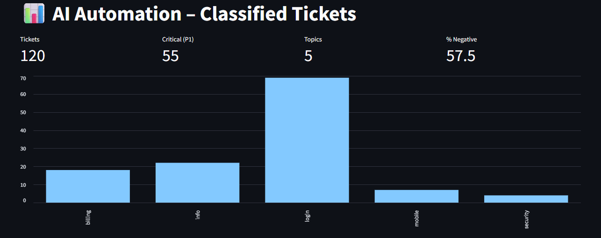


### Week 2

Integration of a local LLM (Ollama) for automated summaries.
The dashboard now displays AI-generated insights + actionable next steps along with KPIs and charts.

Screenshot:
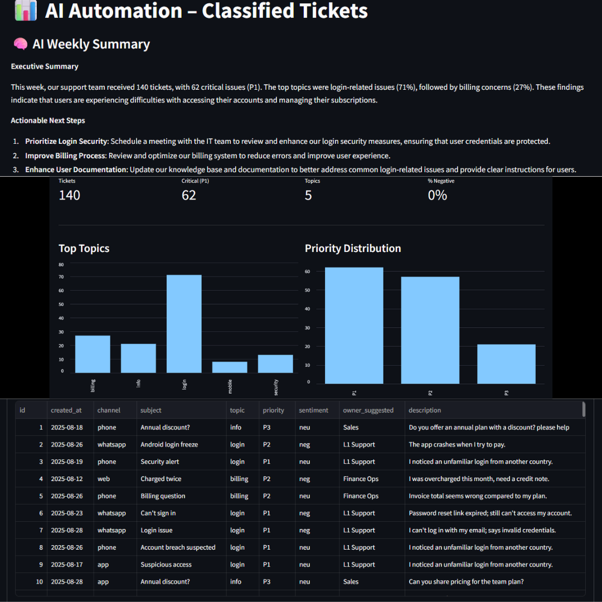


### Week 3

- Implemented **real-time Telegram alerts** for P1 (critical) tickets.  
- Enhanced **dashboard** with filters, AI summaries, and drill-down views.  
- Added **testing utilities** (`scripts/add_test_p1.py`) to simulate alerts for recruiters/teachers.  

Screenshots:  
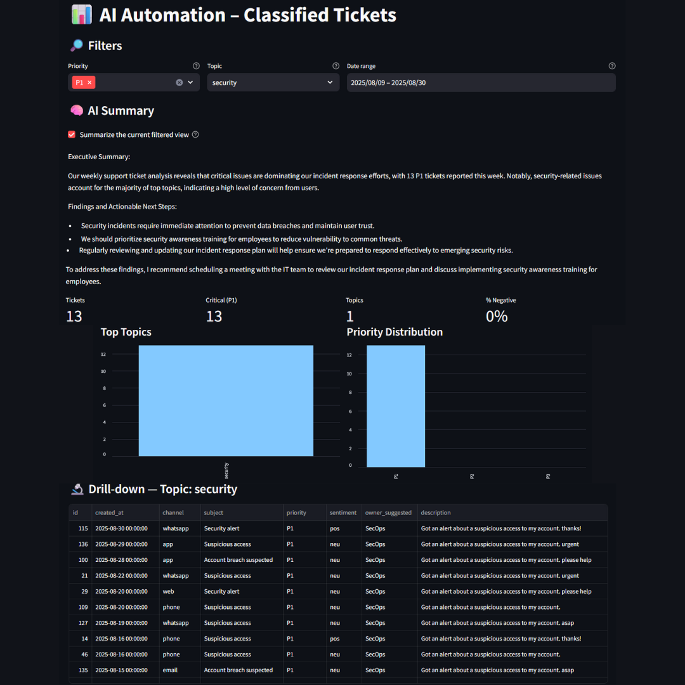  
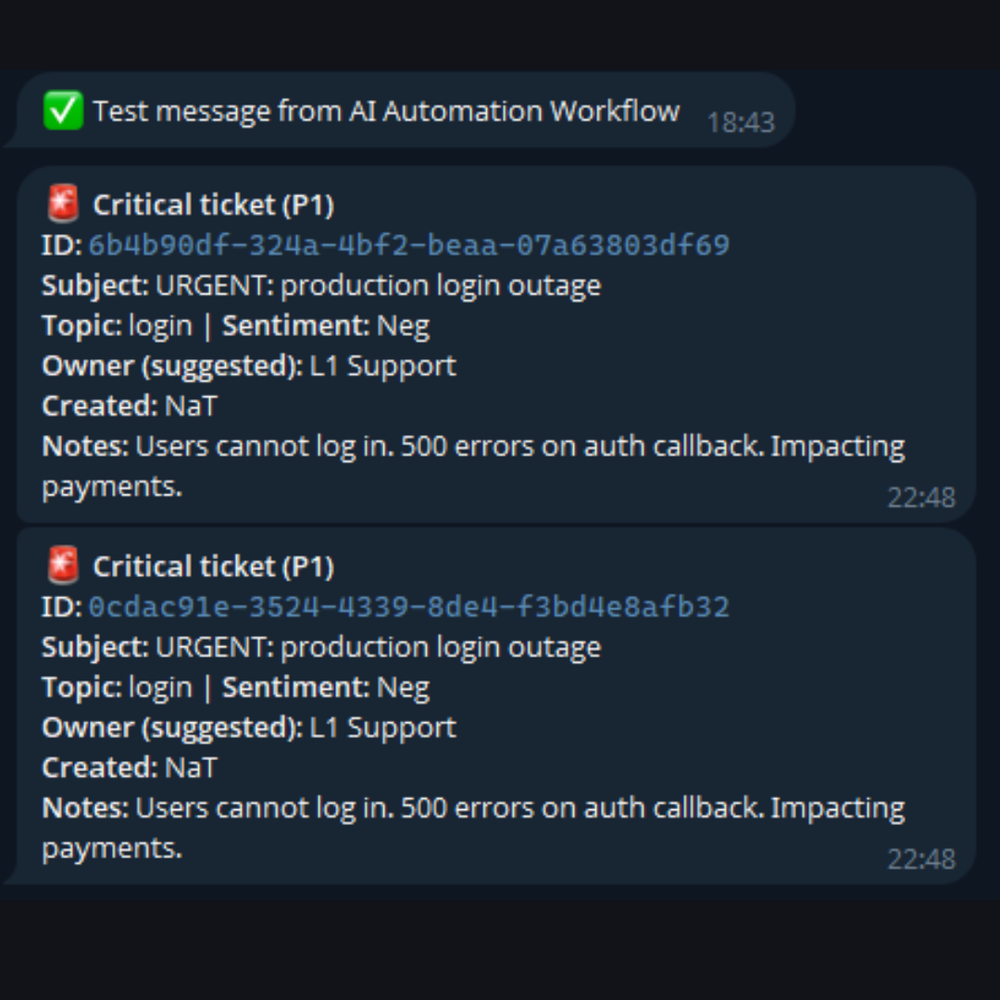


### Week 4 – Orchestration & Alerts

In Week 4 we integrated **orchestration (n8n)** with our pipeline and connected it to **real-time notifications** via Telegram.

- **n8n workflow**: scheduled job (every minute) triggers the pipeline via HTTP POST → `uvicorn` backend processes rows.  
- **uvicorn backend**: runs `process_new_rows.py`, classifies new tickets, summarizes with LLM, and detects P1.  
- **Telegram bot**: receives instant alerts for P1-critical tickets.

### Evidence

- Workflow in **n8n**:  
  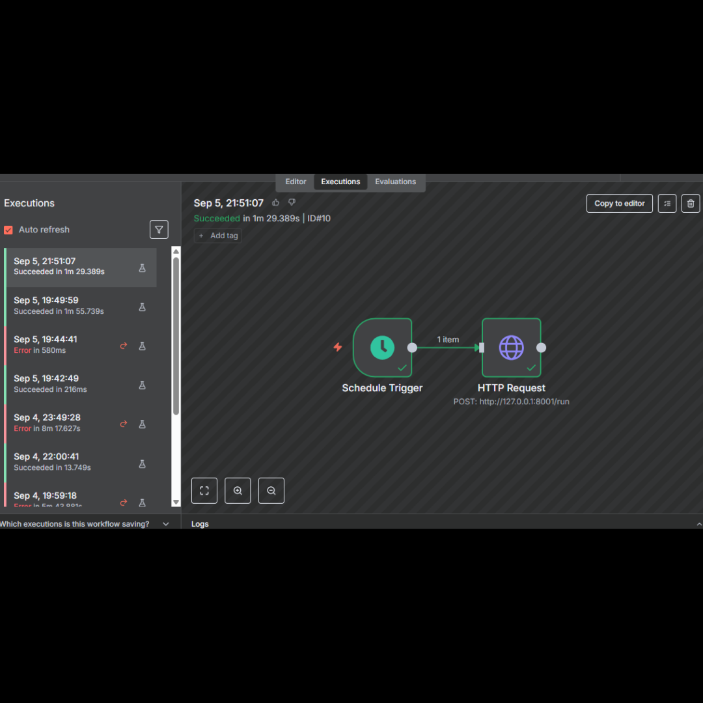

- Backend logs in **uvicorn**:  
  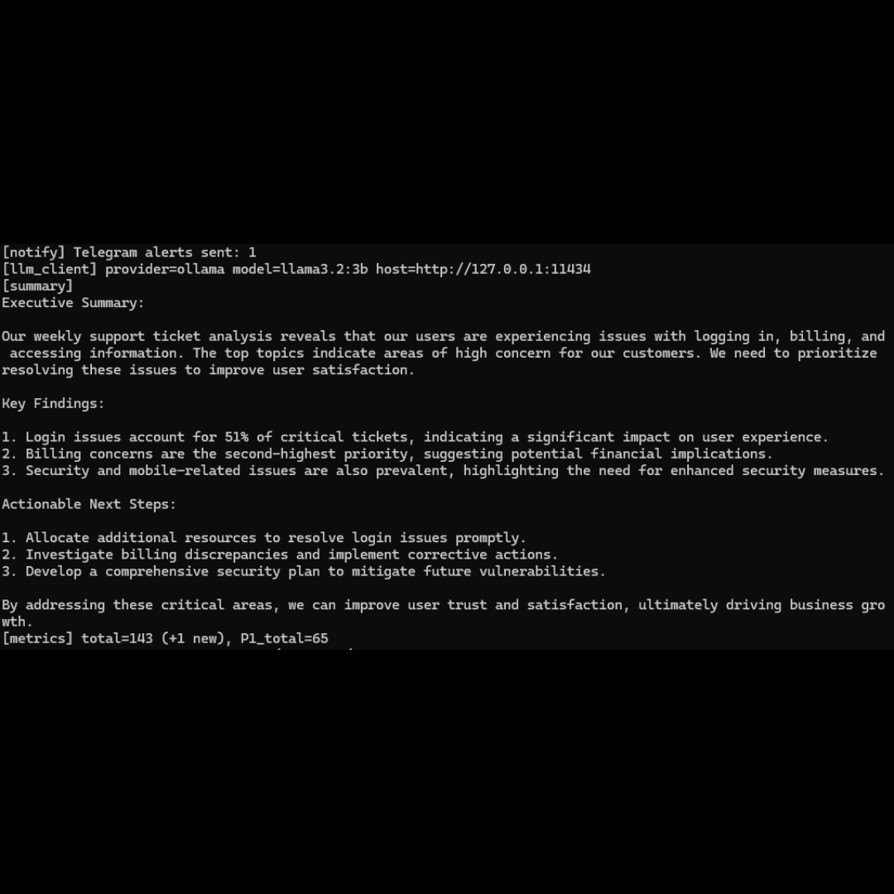

- **Telegram notification** of a synthetic P1 ticket:  
  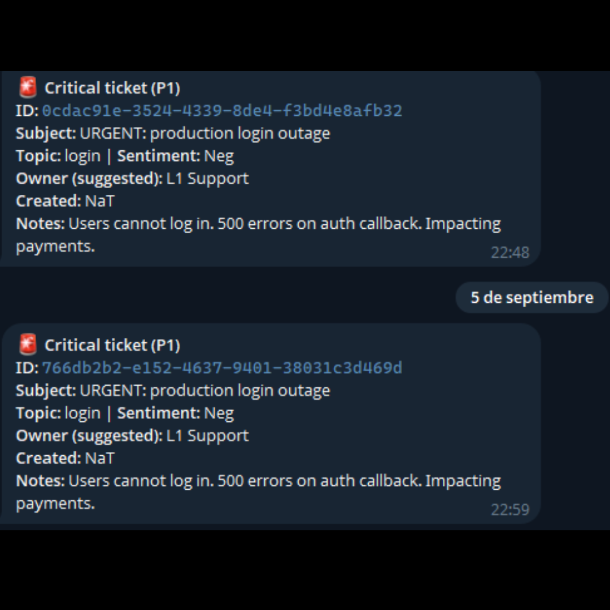


### Week 5 – Logging & System Health

- Added **structured logging** with request/ticket IDs.  
- Implemented **Dead Letter Queue (DLQ)** for failed notifications (7-day retention).  
- New **/metrics endpoint** with processed, failed, DLQ and notification counters.  
- Streamlit dashboard extended with **System Health** and **DLQ tabs**.  

Screenshots:  
- **System Health**:  
  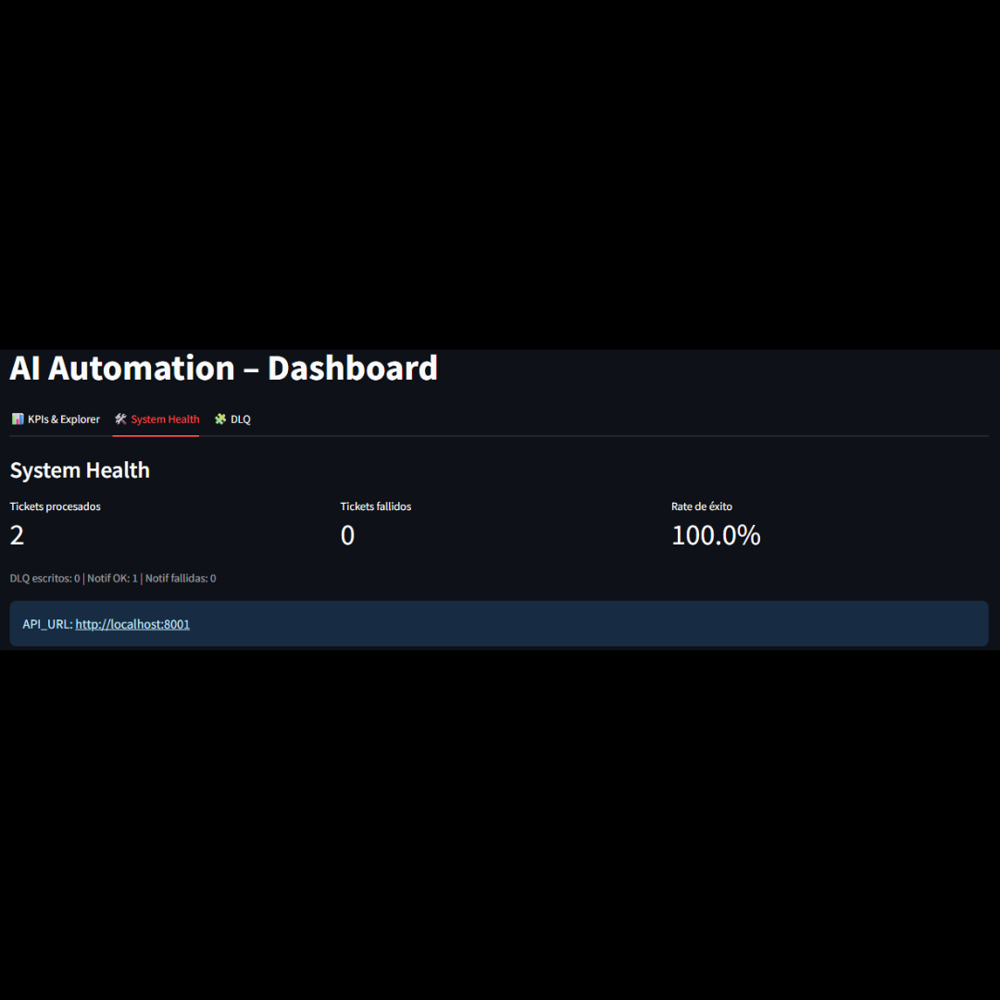

- **Dead Letter Queue**:  
  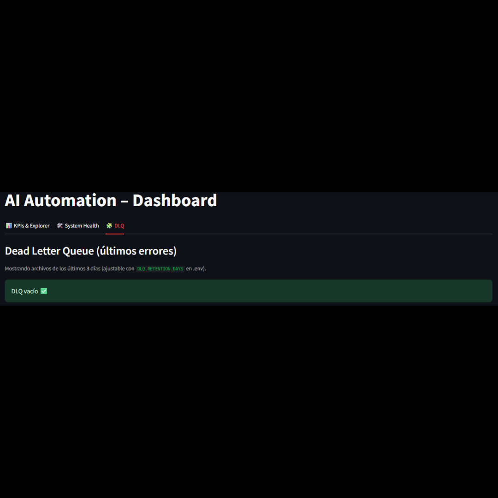


### Week 6 – Retry & Error Metrics

- Added **retry counters** for failed notifications (success/fail).  
- Extended **System Health** with retry rate, error rate, and notification metrics.  
- DLQ view enhanced with contextual details for failed tickets.  

Screenshots:  
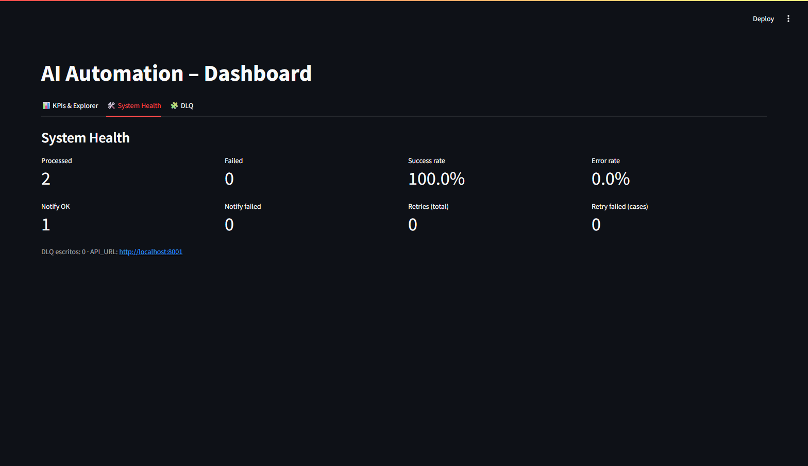  
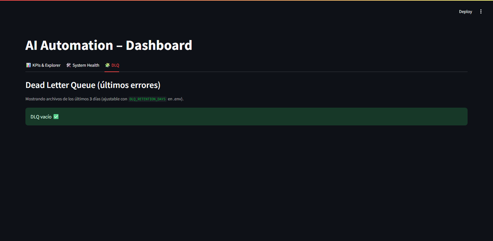
 ---

## ⚙️ Setup

### Requirements

* Python 3.11+
* Google account (with Google Sheets API enabled)
* Telegram Bot token (optional, for notifications)
* Docker (optional, for n8n)

### Environment Variables

Copy `.env.example` to `.env` and fill in:

```
# Google
GOOGLE_SHEETS_CREDENTIALS_JSON=./google_creds.json
GOOGLE_SHEETS_SPREADSHEET_ID="<your_spreadsheet_id>"
GOOGLE_SHEETS_INPUT_RANGE="FormResponses!A:Z"
GOOGLE_SHEETS_OUTPUT_RANGE="Classified!A:Z"

# LLM (choose one)
OPENAI_API_KEY="sk-..."             # if using OpenAI/Azure
OLLAMA_HOST="http://localhost:11434" # if using local Ollama
LLM_MODEL_NAME="gpt-4o-mini"         # or "llama3:instruct"

# Notifications
TELEGRAM_BOT_TOKEN="<token>"
TELEGRAM_CHAT_ID="<chat_id>"
GMAIL_SENDER="your_email@gmail.com"    # optional
GMAIL_OAUTH_JSON=./gmail_creds.json     # optional
```

---

## ▶️ How to run

1. **Environment**

```bash
python -m venv .venv && source .venv/bin/activate  # Windows: .venv\\Scripts\\activate
pip install -r requirements.txt
```

2. **n8n (optional)**

```bash
docker run -it --rm -p 5678:5678 -v ~/.n8n:/home/node/.n8n n8nio/n8n
# import flows/n8n_mvp.json and configure credentials
```

3. **Run processing job**

```bash
python -m src.jobs.process_new_rows
```

4. **Dashboard**

```bash
streamlit run src/dashboard/Home.py
```

---

## 📈 Initial Dashboard Metrics

* Volume by day/week
* % by priority (P1–P3)
* Topic distribution (top 10)
* Average sentiment
* Mean time to notification (simulated)
* **AI Insight**: auto-generated paragraph with 3–5 findings and suggested next actions

---

## 🧪 Sample Dataset

Includes `data/sample_tickets.csv` with \~100 synthetic rows (English) for end‑to‑end testing without credentials. The job can run in `--local-csv` mode.

---

## 📢 LinkedIn Communication

* **Fridays**: weekly progress update (gif/screenshot) + focus on applied skill.
* CTA: public repo + short thread of tech decisions (why Sheets, why n8n, why Streamlit).

---

## 🔒 Security Considerations

* Do not store real PII; use synthetic or anonymized data.
* Limit Google/Gmail scopes to the minimum required.
* Rotate tokens and store credential `.json` securely.

---

## 📝 License

MIT.

---

## 🙌 Credits

Design & development: Herman Schubert (dochronos). Inspired by real-world support/ops workflows.
